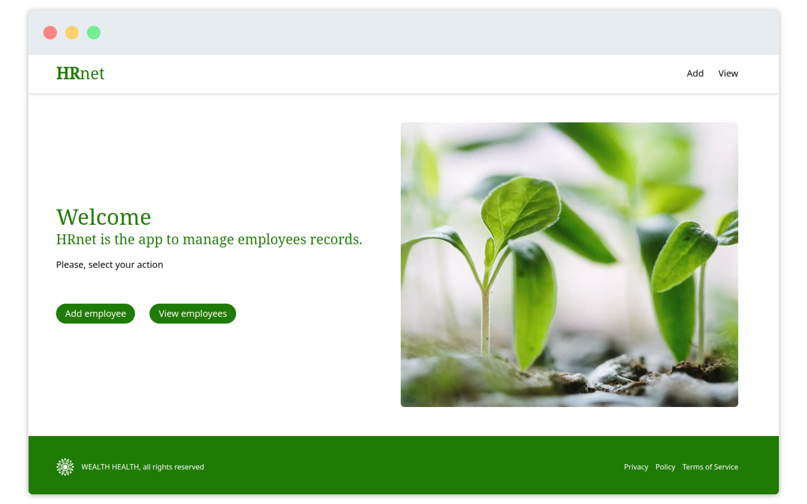

# oc-p14-hrnet 👋

[](https://nodejs.org/)
[](https://vitejs.dev/)
[](https://www.typescriptlang.org/)
[](https://reactjs.org/)
[](https://reactrouter.com/)
[](https://react-hook-form.com/)
[](https://github.com/colinhacks/zod)
[](https://tailwindcss.com/)

This project is the n°14 of the [OpenClassrooms Front-End learning path](https://openclassrooms.com/fr/paths/516-developpeur-dapplication-javascript-react).

**WealthHealth** is a large financial company that uses an in-house employee management application: **HRnet**. My main goal is to update HRnet and convert it to React. The old version uses 4 JQuery plugins : datetimepicker, jquery-modal, jquery-ui/selectmenu, DataTables.

The main tasks:

- [x] Convert the entire project to React
- [x] Add a state management system
- [x] Publish a React plugin to NPM : [ja-react-table](https://www.npmjs.com/package/ja-react-table)
- [x] Performance report between old and new version

## ✨ Demo

- Github: [jeromeabel.github.io/oc-p14-hrnet](https://jeromeabel.github.io/oc-p14-hrnet/)
- For Lighthouse audit, we need another type of web hosting, like Apache server: [jeromeabel.net/oc-p14-hrnet](https://jeromeabel.net/oc-p14-hrnet)



Credit photo: [Francesco Gallarotti](https://unsplash.com/fr/photos/ruQHpukrN7c)

## ✔️ Report


## 🚨 Prerequisites

To get and build the project you will need to install :

- [NodeJS](https://nodejs.org/)
- [Git](https://git-scm.com/)
- A terminal to run commands. If you don't have one, I would recommend to use [Visual Studio Code](https://code.visualstudio.com/), it provides an integrated terminal inside the code editor.
- Optional : PNPM instead of NPM

## 🛠️ Installation

```sh
git clone https://github.com/jeromeabel/oc-p14-hrnet.git
cd oc-p14-hrnet
pnpm install
```

## 🚀 Usage

```sh
pnpm run dev
```

And open the browser at this address : http://localhost:5173/

## 👤 Author

[@jeromeabel](https://github.com/jeromeabel)

## 📝 License

[GNU--GPL--3](https://www.gnu.org/licenses/gpl-3.0.fr.html)
